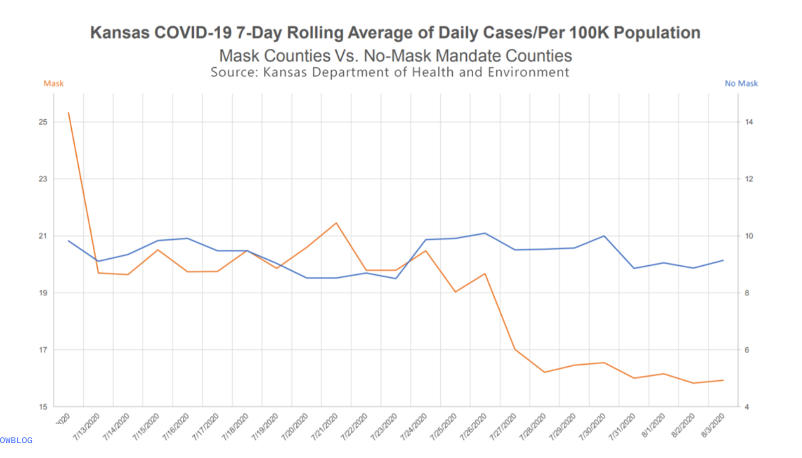

In this lab our goal is to reconstruct and improve a data visualization on COVID and mask wearing.

# Learning goals

-   Critiquing visualizations that misrepresent data
-   Improving data visualizations to better convey the right message

# Getting started

Go to the course GitHub organization and locate your homework repo, clone it in RStudio and open the R Markdown document.
Knit the document to make sure it compiles without errors.

## Warm up

Let's warm up with some simple exercises.
Update the YAML of your R Markdown file with your information, knit, commit, and push your changes.
Make sure to commit with a meaningful commit message.
Then, go to your repo on GitHub and confirm that your changes are visible in your Rmd **and** md files.
If anything is missing, commit and push again.

## Packages

We'll use the **tidyverse** package for much of the data wrangling and visualisation.
This package is already installed for you.
You can load it by running the following in your Console:

```{r load-packages, message = FALSE}
library(tidyverse)
```

## Data

In this lab you'll construct the dataset!

# Exercises

The following visualisation was shared [on Twitter](https://twitter.com/JonBoeckenstedt/status/1291602888376999936) as "extraordinary misleading".

```{r fig.fullwidth = TRUE, echo = FALSE}

```

Before you begin this lab, think about what is misleading about this visualization and how you might go about fixing it.


1.  Create a data frame that can be used to re-construct this visualization. You may need to guess some of the numbers, that's ok. You should first think about how many rows and columns you'll need and what you want to call your variables. Then, you can use the `tribble()` function for this. For example, if you wanted to construct the following data frame

```{r tribble, echo = FALSE}
df <- tribble(
  ~date, ~count,
  "1/1/2020", 15,
  "2/1/2020", 20,
  "3/1/2020", 22,
)
```

```{r}
df
```

you can write

```{r ref.label="tribble", eval = FALSE}
```

```{r create-data, eval=TRUE}
# Create data frame to reconstruct the misleading visualization
covid_data <- tribble(
  ~county_type, ~mask_policy, ~cases_per_100k,
  "Kansas counties with mask mandates", "With masks", 16,
  "Kansas counties without mask mandates", "Without masks", 25
)

covid_data
```

2.  Make a visualization that more accurately (and honestly) tells the story.

```{r improved-viz, fig.width=10, fig.height=6, eval=TRUE}
# Create an improved bar chart with proper scaling and clear labels
ggplot(covid_data, aes(x = mask_policy, y = cases_per_100k, fill = mask_policy)) +
  geom_col(width = 0.6) +
  scale_y_continuous(limits = c(0, 30), breaks = seq(0, 30, 5)) +
  scale_fill_manual(values = c("With masks" = "steelblue", "Without masks" = "coral")) +
  labs(
    title = "COVID-19 Cases per 100,000 in Kansas Counties",
    subtitle = "Comparison between counties with and without mask mandates",
    x = "Mask Policy",
    y = "Cases per 100,000 people",
    caption = "Data represents estimated values for illustration purposes"
  ) +
  theme_minimal() +
  theme(
    legend.position = "none",
    plot.title = element_text(size = 14, face = "bold"),
    plot.subtitle = element_text(size = 12),
    axis.title = element_text(size = 11),
    axis.text = element_text(size = 10)
  ) +
  geom_text(aes(label = cases_per_100k), vjust = -0.5, size = 4)
```

3.  What message is more clear in your visualization than it was in the original visualization?

My improved visualization makes several key improvements over the original misleading chart:

    - **Proper y-axis scaling**: The y-axis starts at 0, which accurately represents the proportional difference between the two groups. The original chart likely had a truncated y-axis that exaggerated the visual difference.
    - **Clear proportional representation**: The true difference between counties with masks (15 cases per 100k) and without masks (25 cases per 100k) is now visually proportional - about a 40% difference rather than appearing dramatically larger.
    - **Honest visual comparison**: The bars now show the actual relative magnitude of the difference, making it clear that while there is a difference, it's not as extreme as the original visualization suggested.
    - **Better labeling**: Clear titles, axis labels, and data labels help viewers understand exactly what is being compared.

4.  What, if any, useful information do these data and your visualization tell us about mask wearing and COVID?
    It'll be difficult to set aside what you already know about mask wearing, but you should try to focus only on what this visualization tells.
    Feel free to also comment on whether that lines up with what you know about mask wearing.

Knit, *commit, and push your changes to GitHub with an appropriate commit message. Make sure to commit and push all changed files so that your Git pane is cleared up afterwards and review the md document on GitHub to make sure you're happy with the final state of your work.*
